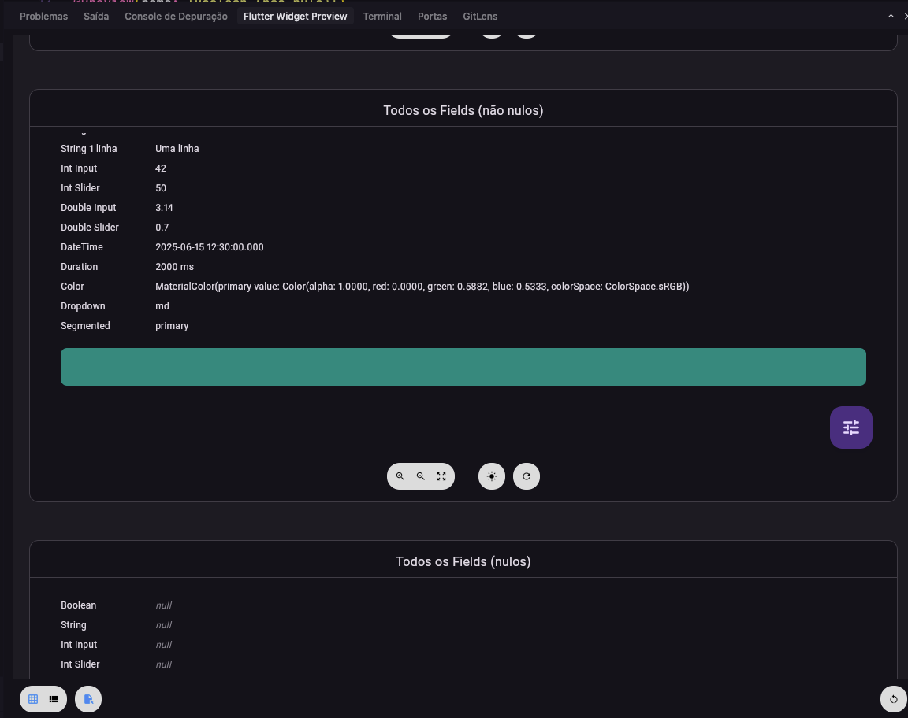

# preview_helper

[](https://pub.dev/packages/preview_helper)
[](LICENSE)

Pacote Flutter para **preview editável em tempo real**: um FAB abre um menu de variáveis, cada uma abre um diálogo para editar o valor, e a tela do preview atualiza na hora. Ideal para telas de preview (ex.: card de artigo, post, ebook) onde você quer testar textos, números e enums sem recompilar.

---

## O que faz

- Envolve seu widget de preview com **`PreviewCustom`** e passa uma lista de campos reativos (`ValueNotifierPreview` / `ValueNotifierPreviewNullable`).
- Um botão flutuante (ícone de **tune**) abre um **menu** com todos os campos; ao escolher um, abre um **diálogo** para editar.
- Valores são **reativos** (`ValueNotifier`): ao aplicar no diálogo, o preview reconstrui automaticamente.
- Suporta **tipos**: `bool`, `int`, `double`, `String`, `Enum` (com lista de opções) e versões **nullable**.
- Opção de **editor customizado** por campo via `editorBuilder`.

### Como fica na prática

No Flutter Widget Preview, o card aparece com um FAB (ícone de tune); ao tocar, abre o menu com todos os campos e seus valores atuais:



Ao escolher um campo (ex.: `description`), abre o diálogo para editar o valor — e o preview atualiza na hora ao aplicar:


---

## Instalação

No `pubspec.yaml`:

```yaml
dependencies:
  preview_helper: ^1.0.0
```

Depois:

```bash
flutter pub get
```

---

## Uso rápido

Use com o **preview do Flutter** (anotação `@Preview`): crie os campos editáveis com **`ValueNotifierPreview`** ou **`ValueNotifierPreviewNullable`**, envolva o widget no **`PreviewCustom`** e passe a lista de notifiers e o **`builder`** que monta o widget usando os valores atuais.

Exemplo com um card de design system:

```dart
import 'package:flutter/material.dart';
import 'package:preview_helper/preview_helper.dart';

@Preview(name: 'Design System Card')
Widget designSystemCardPreview() {
  final title = ValueNotifierPreview<String>(
    name: 'title',
    value: 'Título do card',
  );
  final avatarImageUrl = ValueNotifierPreviewNullable<String>(
    name: 'avatarImageUrl',
    defaultValue: "",
    value: null,
  );
  final description = ValueNotifierPreviewNullable<String>(
    name: 'description',
    value: 'Descrição do card',
    defaultValue: 'Descrição do card',
  );
  final authorName = ValueNotifierPreviewNullable<String>(
    name: 'authorName',
    value: 'Maria Silva Ferreira',
    defaultValue: 'Maria Silva Ferreira',
  );
  final primaryButtonLabel = ValueNotifierPreviewNullable<String>(
    name: 'primaryButtonLabel',
    value: 'Button Label',
    defaultValue: 'Button Label',
  );
  final secondaryButtonLabel = ValueNotifierPreviewNullable<String>(
    name: 'secondaryButtonLabel',
    value: 'Button Label',
    defaultValue: 'Button Label',
  );
  final iconType = ValueNotifierPreviewNullable<DesignSystemCardIconType>(
    name: 'iconType',
    value: DesignSystemCardIconType.personOutline,
    enumValues: DesignSystemCardIconType.values,
    defaultValue: DesignSystemCardIconType.personOutline,
  );
  final iconSize = ValueNotifierPreviewNullable<double>(
    name: 'iconSize',
    value: null,
    defaultValue: 40,
  );
  final iconOpacity = ValueNotifierPreviewNullable<double>(
    name: 'iconOpacity',
    value: 1.2,
    defaultValue: 1.2,
  );

  return PreviewCustom(
    notifiers: [
      title,
      avatarImageUrl,
      description,
      authorName,
      primaryButtonLabel,
      secondaryButtonLabel,
      iconType,
      iconSize,
      iconOpacity,
    ],
    builder: (context) => DesignSystemCard(
      title: title.value,
      description: description.value,
      avatarImageUrl: avatarImageUrl.value,
      authorName: authorName.value,
      primaryButtonLabel: primaryButtonLabel.value,
      secondaryButtonLabel: secondaryButtonLabel.value,
      iconType: iconType.value,
      iconSize: iconSize.value,
      iconOpacity: iconOpacity.value,
      onPrimaryPressed: () {},
      onSecondaryPressed: () {},
      onAuthorTap: () {},
    ),
  );
}
```

Ao abrir o preview no Flutter, o FAB (ícone de tune) mostra o menu com todos os campos. Escolhendo um, abre o diálogo de edição; ao aplicar, o card atualiza na hora.

---

## API em poucas linhas

| Classe / tipo                         | Descrição                                                                      |
| ------------------------------------- | ------------------------------------------------------------------------------ |
| **`PreviewCustom`**                   | Envolve o preview + FAB + menu + diálogos. Recebe `notifiers` e `builder`.     |
| **`ValueNotifierPreview<T>`**         | Campo não-nulo: `name`, `value`, opcionalmente `enumValues` e `editorBuilder`. |
| **`ValueNotifierPreviewNullable<T>`** | Campo que pode ser `null`; mesmo contrato + `defaultValue`.                    |
| **`PreviewEditDialog<T>`**            | Diálogo de edição (usado internamente; pode ser usado direto se quiser).       |
| **`PreviewEditorParams<T>`**          | Parâmetros do editor (nome, valor, notifier, callbacks, etc.).                 |
| **`PreviewEditorBuilder`**            | `Widget? Function(BuildContext, PreviewEditorParams)` para editor customizado. |

### Enum

Para enums, passe a lista de opções em **`enumValues`**:

```dart
enum Status { draft, published, archived }

final status = ValueNotifierPreview<Status?>(
  name: 'Status',
  value: Status.draft,
  enumValues: Status.values,
);
```

### Editor customizado

Se quiser um widget de edição próprio para um campo:

```dart
final special = ValueNotifierPreviewNullable<String>(
  name: 'Cor',
  value: '#FF0000',
  defaultValue: '#000000',
  editorBuilder: (context, params) {
    return Column(
      crossAxisAlignment: CrossAxisAlignment.start,
      children: [
        Text(params.fieldName, style: Theme.of(context).textTheme.titleMedium),
        TextField(
          controller: params.textController,
          decoration: InputDecoration(
            hintText: 'Ex: #FF0000',
            errorText: params.parseError ? 'Cor inválida' : null,
          ),
          onChanged: (text) {
            // validação e params.onValueChanged / onParseErrorChanged
          },
        ),
      ],
    );
  },
);
```

Se `editorBuilder` retornar `null`, o pacote usa o editor padrão (bool, int, double, string, enum).

---

## Requisitos

- **SDK:** Dart ^3.10.7
- **Flutter:** >=1.17.0

---

## Licença

Apache 2.0. Ver [LICENSE](LICENSE).

---

## Repositório e autor

- **Repositório:** [github.com/rod-moraes/preview_helper](https://github.com/rod-moraes/preview_helper)
- **Homepage:** [rodmoraes.com.br](https://rodmoraes.com.br)

Se encontrar bugs ou tiver sugestões, abra uma issue no GitHub.
