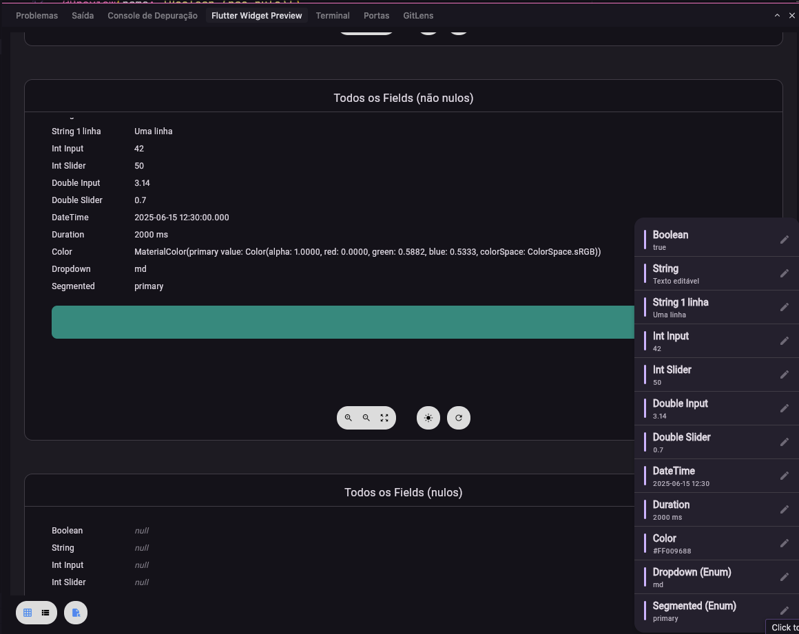
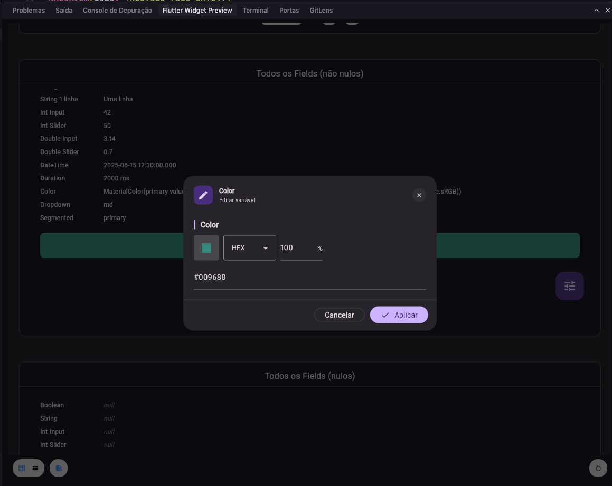

# preview_helper

[](https://pub.dev/packages/preview_helper)
[](LICENSE)

Pacote Flutter para **preview editável em tempo real**. Um FAB abre um menu de variáveis tipadas (knobs), cada uma abre um diálogo de edição, e o preview atualiza na hora — tudo sem recompilar.

Funciona com o **Flutter Widget Preview** (`@Preview`) e qualquer `ValueNotifier`.

---

## Recursos

- **12 tipos de knob** prontos: `bool`, `String`, `int` (input e slider), `double` (input e slider), `DateTime`, `Duration`, `Color`, `Enum` (dropdown e segmented).
- **Versão nullable** de cada tipo — com botão "NULL" no diálogo.
- **Menu estilizado** com barra de acento, resumo do valor atual e ícone de edição.
- **Diálogo moderno** com header, editor do campo e ações (Cancelar / Aplicar / NULL).
- **Layout consistente** nos campos: `InputDecoration` padronizado, badge de valor nos sliders, switch inline no boolean.
- **Editor customizado** por campo via `editorBuilder`.
- **Zero dependências** além do Flutter SDK.

---

## Como fica na prática

No Flutter Widget Preview, o conteúdo aparece com um FAB (ícone de tune) no canto. Ao tocar, abre o menu com todos os campos e seus valores atuais.


Cada item do menu mostra o nome do campo e um resumo do valor. Ao escolher um, abre o diálogo de edição.



No diálogo você edita o valor (por tipo: texto, número, slider, data, cor, enum etc.) e aplica — o preview atualiza na hora. Campos nullable exibem o botão **NULL**.



---

## Instalação

```yaml
dependencies:
  preview_helper: ^2.0.0+1
```

```bash
flutter pub get
```

---

## Uso rápido

### 1. Knob não-nulo

Crie um knob tipado, passe para `PreviewCustom` e use `.value` no builder:

```dart
import 'package:flutter/material.dart';
import 'package:flutter/widget_previews.dart';
import 'package:preview_helper/preview_helper.dart';

@Preview(name: 'Exemplo String')
Widget stringPreview() {
  final title = StringPreviewKnob(name: 'title', value: 'Hello World');

  return PreviewCustom(
    notifiers: [title],
    builder: (context) => Center(
      child: Text(title.value ?? '', style: Theme.of(context).textTheme.headlineMedium),
    ),
  );
}
```

### 2. Knob nullable

Use a versão `Nullable` do knob — o diálogo ganha o botão "NULL":

```dart
@Preview(name: 'Exemplo String Nullable')
Widget stringNullablePreview() {
  final title = StringNullablePreviewKnob(
    name: 'title',
    value: null,
    defaultValue: 'Texto padrão',
  );

  return PreviewCustom(
    notifiers: [title],
    builder: (context) => Center(
      child: Text(title.value ?? '(null)'),
    ),
  );
}
```

### 3. Vários knobs juntos

```dart
@Preview(name: 'Design System Card')
Widget designSystemCardPreview() {
  final title = StringPreviewKnob(name: 'title', value: 'Title');
  final count = IntInputPreviewKnob(name: 'count', value: 3);
  final rating = DoubleSliderPreviewKnob(name: 'rating', value: 4.5, min: 0, max: 5, precision: 1);
  final enabled = BooleanPreviewKnob(name: 'enabled', value: true);
  final accent = ColorPreviewKnob(name: 'accent', value: Colors.deepPurple);

  return PreviewCustom(
    notifiers: [title, count, rating, enabled, accent],
    builder: (context) => MyCard(
      title: title.value ?? '',
      count: count.value ?? 0,
      rating: rating.value ?? 4.5,
      enabled: enabled.value ?? false,
      accentColor: accent.value ?? Colors.deepPurple,
    ),
  );
}
```

---

## Catálogo de knobs

Cada knob tem uma versão **não-nula** e uma **nullable**:

| Tipo               | Knob                            | Knob Nullable                           |
| ------------------ | ------------------------------- | --------------------------------------- |
| `bool`             | `BooleanPreviewKnob`            | `BooleanNullablePreviewKnob`            |
| `String`           | `StringPreviewKnob`             | `StringNullablePreviewKnob`             |
| `int` (input)      | `IntInputPreviewKnob`           | `IntInputNullablePreviewKnob`           |
| `int` (slider)     | `IntSliderPreviewKnob`          | `IntSliderNullablePreviewKnob`          |
| `double` (input)   | `DoubleInputPreviewKnob`        | `DoubleInputNullablePreviewKnob`        |
| `double` (slider)  | `DoubleSliderPreviewKnob`       | `DoubleSliderNullablePreviewKnob`       |
| `DateTime`         | `DateTimePreviewKnob`           | `DateTimeNullablePreviewKnob`           |
| `Duration`         | `DurationPreviewKnob`           | `DurationNullablePreviewKnob`           |
| `Color`            | `ColorPreviewKnob`              | `ColorNullablePreviewKnob`              |
| `Enum` (dropdown)  | `ObjectDropdownPreviewKnob<T>`  | `ObjectDropdownNullablePreviewKnob<T>`  |
| `Enum` (segmented) | `ObjectSegmentedPreviewKnob<T>` | `ObjectSegmentedNullablePreviewKnob<T>` |

### Parâmetros comuns

| Parâmetro       | Obrigatório        | Descrição                                                 |
| --------------- | ------------------ | --------------------------------------------------------- |
| `name`          | sim                | Nome exibido no menu e no diálogo.                        |
| `value`         | sim                | Valor inicial (pode ser `null` nos nullable).             |
| `defaultValue`  | nullable           | Valor padrão quando nulo (obrigatório nos nullable).      |
| `min` / `max`   | sliders            | Limites do slider.                                        |
| `divisions`     | sliders            | Número de divisões do slider.                             |
| `precision`     | double slider      | Casas decimais exibidas.                                  |
| `maxLines`      | string             | Número máximo de linhas do campo de texto (padrão: 3).    |
| `start` / `end` | datetime           | Limites do date picker.                                   |
| `options`       | dropdown/segmented | Lista de opções (`List<T>`).                              |
| `labelBuilder`  | dropdown/segmented | Função `String Function(T)` para exibir o label da opção. |

---

## API principal

| Classe                            | Descrição                                                                             |
| --------------------------------- | ------------------------------------------------------------------------------------- |
| `PreviewCustom`                   | Widget que envolve o preview + FAB + menu + diálogos. Recebe `notifiers` e `builder`. |
| `ValueNotifierPreview<T>`         | Base não-nula. Estenda ou use os knobs concretos.                                     |
| `ValueNotifierPreviewNullable<T>` | Base nullable. Estenda ou use os knobs concretos.                                     |
| `PreviewEditDialog<T>`            | Diálogo de edição (usado internamente; pode ser usado direto).                        |
| `PreviewEditorParams<T>`          | Parâmetros injetados no editor (nome, valor, notifier, callbacks).                    |
| `PreviewEditorBuilder`            | `Widget? Function(BuildContext, PreviewEditorParams)` para editor customizado.        |

---

## Editor customizado

Se quiser um widget de edição próprio para um campo, passe `editorBuilder` no knob. Se retornar `null`, o pacote usa o editor padrão.

```dart
final special = StringNullablePreviewKnob(
  name: 'Cor hex',
  value: '#FF0000',
  defaultValue: '#000000',
  editorBuilder: (context, params) {
    return Padding(
      padding: const EdgeInsets.all(16),
      child: TextField(
        controller: params.textController,
        decoration: InputDecoration(
          labelText: params.fieldName,
          hintText: 'Ex: #FF0000',
          errorText: params.parseError ? 'Cor inválida' : null,
        ),
        onChanged: (text) {
          params.onValueChanged(text);
        },
      ),
    );
  },
);
```

---

## Exemplo completo

Veja a pasta [`example/`](example/) com previews para **todos os 12 tipos**, em versão não-nula e nullable, além de um exemplo agregado (Design System Card).

Para rodar:

```bash
cd example
flutter run
```

---

## Requisitos

- **SDK:** Dart ^3.10.7
- **Flutter:** >=1.17.0

---

## Licença

Apache 2.0. Ver [LICENSE](LICENSE).

---

## Repositório e autor

- **Repositório:** [github.com/rod-moraes/preview_helper](https://github.com/rod-moraes/preview_helper)
- **Homepage:** [rodmoraes.com.br](https://rodmoraes.com.br)

Se encontrar bugs ou tiver sugestões, abra uma [issue](https://github.com/rod-moraes/preview_helper/issues) no GitHub.
